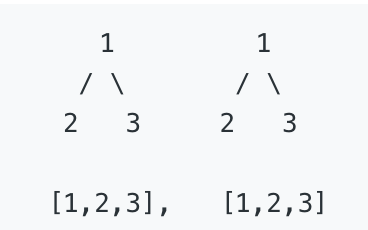
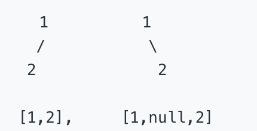
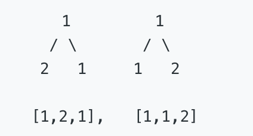

##  题目如下：

给定两个二叉树，编写一个函数来检验它们是否相同。
如果两个树在结构上相同，并且节点具有相同的值，则认为它们是相同的。

## 示例：

- 示例1：
	输入:
	
	输出: true

- 示例2：
	输入:

输出: false

- 示例3:
输入:

输出: false

## 解题思路：

判断A树和B树是否相同,则是判断A树和B树的所有子节点都相同；可以利用递归,递归体是判断A树和B树的子节点是否相同；递归的停止条件是当 A树的节点跟B树的节点同时为时空返回true,当A树的节点不为空或者B树的节点不为空则返回false；
- 代码如下：

``` javascript
// 生成树的代码
function TreeNode(val, left, right) {
    this.val = val;
    this.left = left;
    this.right = right;
}
let left = new TreeNode(2, null, null);
let right = new TreeNode(3, null, null);
let node = new TreeNode(1, left, right);
// 判断两颗树是否相同：
/**
 * @param {TreeNode} p
 * @param {TreeNode} q
 * @return {boolean}
 */
var isSameTree = function(p, q) {
	// 若A树和B树都为空,则返回true
    if (!p && !q) {
        return true;
    }
	// 若节点 p 跟 节点  q 有一个不为空,则返回false
    if (!p || !q) {
        return false;
    }
	// 如果节点p 跟 节点q 的val值不相同,也返回false
    if (p.val !=  q.val) {
        return false;
    }
	// 递归调用,判断 p跟 q的子节点
    return arguments.callee(p.left, q.left) && arguments.callee(p.right, q.right);
};
console.log(isSameTree(node, node));
// 执行用时: 84 ms
// 内存消耗: 33.7 MB
```

与递归相对应的就是采用迭代的方式；
代码如下：

``` javascript
/**
 * @param {TreeNode} p
 * @param {TreeNode} q
 * @return {boolean}
 */
var isSameTree = function(p, q) {
	// p 跟 q 都不存在
    if (!p && !q) {
        return true;
    }
	// p 跟 q 存在一个
    if (!p || !q) {
        return false;
    }
	// 记录p树的可循环节点
    var loopArrP = [p];
	// 记录q树的可循环节点
    var loopArrQ = [q];
    while(loopArrP.length) {
        var tempLoopArrP = [];
        var tempLoopArrQ = [];
        for (var i = 0; i <  loopArrP.length; i++) {
            if (loopArrP[i].val === loopArrQ[i].val) {
				//判断左子树
                if (loopArrP[i].left && loopArrQ[i].left) {
                    tempLoopArrP.push(loopArrP[i].left);
                    tempLoopArrQ.push(loopArrQ[i].left);
                } else if (loopArrP[i].left || loopArrQ[i].left) {
                    return false;
                }
				// 判断右子树
                if(loopArrP[i].right && loopArrQ[i].right) {
                    tempLoopArrP.push(loopArrP[i].right);
                    tempLoopArrQ.push(loopArrQ[i].right);
                } else if(loopArrP[i].right || loopArrQ[i].right) {
                    return false;
                }
            } else {
                return false;
            }
        }
        loopArrP = tempLoopArrP;
        loopArrQ = tempLoopArrQ;
    }
    return true;
};
console.log(isSameTree(node1, node2));
// 执行用时: 60 ms
// 内存消耗: 33.8 MB
```