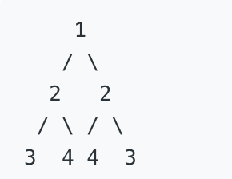
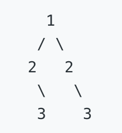

## 题目描述：

给定一个二叉树，检查它是否是镜像对称的。

## 示例：

- 二叉树 [1,2,2,3,4,4,3] 是对称的。
	
- 但是下面这个 [1,2,2,null,3,null,3] 则不是镜像对称的:
	
- 说明: 如果你可以运用递归和迭代两种方法解决这个问题，会很加分。

## 解题思路:
判断树A是否为镜像对称,判断A树左子树的值等于右子树的值,若左子树依然存在左右子树,则拿左子树的左子树跟右子树的右子树比较,依次递归.

- 实现代码如下：

``` javascript
// 实现树结构
function TreeNode(val, left, right) {
    this.val = val;
    this.left = left;
    this.right = right;
}
let num3 = new TreeNode(3, null, null);
let num4 = new TreeNode(4, null, null);
let leftNum2 = new TreeNode(2, num3, num4);
let rightNum2 = new TreeNode(2, num4, num3);
let root = new TreeNode(1, leftNum2, rightNum2);

/**
 * @param {TreeNode} root
 * @return {boolean}
 */
// 判断是否镜像对称函数
var isSymmetric = function(root) {
    if (!root) {
        return true;
    }
    let leftIndex = root.left;
    let rightIndex = root.right;
    function isEqual (leftIndex, rightIndex) {
		// leftIndex 跟 rightIndex 都不存在
        if (!leftIndex && !rightIndex) {
            return true;
        }
		// leftIndex或rightIndex不存在 或 leftIndex的值不等于rightIndex的值
        if ((!leftIndex || !rightIndex) || (leftIndex.val != rightIndex.val)) {
            return false;
        }
        return isEqual(leftIndex.left, rightIndex.right) && isEqual(leftIndex.right, rightIndex.left);
    };
    return isEqual(leftIndex, rightIndex);
};
console.log(isSymmetric(root));
// 执行用时: 80 ms
// 内存消耗: 35.6 MB
```

使用迭代实现代码如下(代码逻辑与110.相同的树相同,不同的是改变了循环体的逻辑):

``` javascript
/**
 * @param {TreeNode} root
 * @return {boolean}
 */
var isSymmetric = function(root) {
    if (!root || (!root.left && !root.right)) {
        return true;
    }
    if ((!root.left || !root.right) || (root.left.val !== root.right.val)) {
        return false;
    }
    var leftArr = [root.left];
    var rightArr = [root.right];
    while(leftArr.length) {
        var tempLeftArr = [];
        var tempRightArr = [];
        for (var i = 0; i < leftArr.length; i ++) {
            if (leftArr[i].val !== rightArr[i].val) {
                return false;
            }
            if (leftArr[i].left && rightArr[i].right) {
                tempLeftArr.push(leftArr[i].left);
                tempRightArr.push(rightArr[i].right);
            }else if (leftArr[i].left || rightArr[i].right) {
                return false;
            }
            if (leftArr[i].right && rightArr[i].left) {
                tempLeftArr.push(leftArr[i].right);
                tempRightArr.push(rightArr[i].left);
            } else if (leftArr[i].right || rightArr[i].left) {
                return false;
            }
        }
        leftArr = tempLeftArr;
        rightArr = tempRightArr;
    }
    return true;
};
console.log(isSymmetric(root));
// 执行用时 : 72 ms
// 内存消耗 : 35.8 MB
```

还有一种方式是采用一个数组,数组的初始值是树的左子树跟右子树,若左子树跟右子树的左右子树都存在,则将左子树的右子树与右子树的左子树push进去,每次截取前两位进行判断.当数组为空时停止循环.代码如下:

``` javascript
/**
 * @param {TreeNode} root
 * @return {boolean}
 */
var isSymmetric = function(root) {
    if (!root || (!root.left && !root.right)) {
        return true;
    }
    if ((!root.left || !root.right) || (root.left.val !== root.right.val)) {
        return false;
    }
    var loopArr = [root.left, root.right];
    while(loopArr.length) {
        var firstNode = loopArr.shift();
        var lastNode = loopArr.shift();
        if (firstNode.val !==  lastNode.val) {
            return false;
        }
        if (firstNode.left && lastNode.right) {
            loopArr.push(firstNode.left, lastNode.right);
        } else if (firstNode.left || lastNode.right) {
            return false;
        }
        if (firstNode.right && lastNode.left) {
            loopArr.push(firstNode.right, lastNode.left);
        } else if(firstNode.right || lastNode.left) {
            return false;
        }
    }
    return true;
};
console.log(isSymmetric(root));
// 执行用时 : 88 ms
// 内存消耗 : 35.6 MB
```
