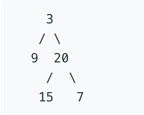

## 题目描述

给定一个二叉树，找出其最大深度。
二叉树的深度为根节点到最远叶子节点的最长路径上的节点数。
说明: 叶子节点是指没有子节点的节点。

## 示例

给定二叉树 [3,9,20,null,null,15,7]



返回它的最大深度 3;

## 解题思路

- 树的最大深度为 1 + Math.max(左子树的最大深度 ,右子树的最大深度);可以利用这个思路进行递归,递归的停止条件是当该子树不存在时返回0;

代码如下：

``` javascript
/**
 * @param {TreeNode} root
 * @return {number}
 */
var maxDepth = function(root) {
    if(!root) {
        return 0;
    }
    const left = maxDepth(root.left);
    const right = maxDepth(root.right);
    return Math.max(left, right) + 1;
};
// 执行用时 : 80 ms
// 内存消耗 : 37.2 MB
```

- 也可以使用迭代去做,使用数组去保存每一层存在的节点,然后一层一层的去遍历,每遍历一层深度加一。

代码如下：

``` javascript
/**
 * @param {TreeNode} root
 * @return {number}
 */
var maxDepth = function(root) {
    if (!root) {
        return 0;
    }
	// 可以将 Array 改为 Set,效率会比Array快
    let mapArr = [root];
    let level = 0;
    while (mapArr.length) {
        level += 1;
        let tempArr = [];
        mapArr.forEach(item => {
            if (item && item.left) {
                tempArr.push(item.left);
            }
            if (item && item.right) {
                tempArr.push(item.right);
            }
        });
        mapArr = tempArr;
    }
    return level;
};
console.log(maxDepth(root));
// 执行用时 : 100 ms
// 内存消耗 : 37.1 MB
```