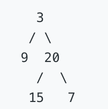

## 题目描述

给定一个二叉树，返回其节点值自底向上的层次遍历。 （即按从叶子节点所在层到根节点所在的层，逐层从左向右遍历）

## 示例

给定二叉树 [3,9,20,null,null,15,7]



返回其自底向上的层次遍历为：
[ [ 15, 7 ], [ 9, 20 ], [3] ];

##  解题思路：

- 从上往下遍历, 依次将遍历的结果puh进数组, 最后将数组翻转, 或者是依次将遍历的结果 unshift 进数组.
	- 使用 loopArr 作为控制循环的数组. loopArr 里保存的是同一 层级上的节点. 若果 loopArr 的长度大于 0  则表示下面还有层级.然后循环 loopArr 里的值.
		- 这里要新建一个 tempLoopResult ，将同一层次有子节点的 node push进 tempLoopResult 里,最后将 loopArr 等于 tempLoopResult .
	- 使用 resultArr 作为节点值的数组, 每次将同一层次遍历到的节点作为数组push进去.
		- 这里可以采用在每遍历到一层的时候先给 resultArr 里 push 一个数组,之后操作 resultArr 里新push进去的数组即可.
		- 还有一种思路是创建 tempResultArr, 先给 tempResultArr  里 push数据，最后再将 tempResultArr push进 resultArr  里.


代码如下：
``` javascript
/**
 * @param {TreeNode} root
 * @return {number[][]}
 */
var levelOrderBottom = function(root) {
   if (!root) {
        return [];
    }
    var resultArr  = [];
    var loopArr = [root];
    while(loopArr.length) {
        resultArr.push([]);
        let tempLoopResult = [];
        loopArr.forEach(item => {
            resultArr[resultArr.length - 1].push(item.val);
            if (item.left) {
                tempLoopResult.push(item.left);
            }
            if (item.right) {
                tempLoopResult.push(item.right);
            }
        })
        loopArr = tempLoopResult;
    }
    return resultArr.reverse();
};
// 执行用时： 120 ms
// 内存消耗： 34.8 MB
```
最后尝试使用递归的方式解决一下,这里新建了一个 tempArr 作为每一层 val 值的数组, 最后将 tempArr unshift 进 resultArr 里. 最后也不用 reverse resultArr. 代码如下：
``` javascript
var levelOrderBottom = function(root) {
    if (!root) {
        return [];
    }
    var resultArr  = [];
    var loopFun  = function (arr) {
        if (!arr.length) {
            return;
        }
        var tempArr = [];
        var loopArr = [];
        arr.forEach(item => {
            tempArr.push(item.val);
            if (item.left) {
                loopArr.push(item.left);
            }
            if (item.right) {
                loopArr.push(item.right);
            }
        })
        resultArr.unshift(tempArr);
        loopFun(loopArr);
    }
    loopFun([root]);
    return resultArr;
};
// 执行用时 : 84 ms
// 内存消耗 : 34.7 MB
```