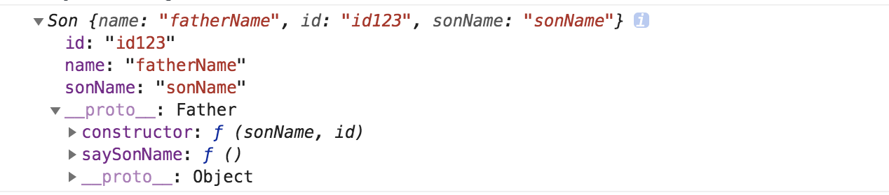
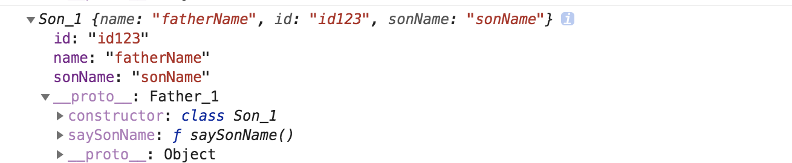

#### 函数继承的 ES5 实现方式

- class extends ES6 的写法：
```javascript
class Father_1{
        constructor(id) {
            this.name = 'fatherName';
            this.id = id;
        }
        sayName() {
            console.log(this.name);
        }
    }
    class Son_1 extends Father_1{
        constructor(sonName, id) {
            super(id);
            this.sonName = sonName;
        }
        saySonName() {
            console.log(this.sonName);
        }
    }
    console.log(new Son_1('sonName', 'id123'));
```
- class extends ES5 的写法：
```javascript
var Father = function(id) {
        this.name = 'fatherName';
        this.id = id;
    }
    Father.prototype.sayName = function() {
        console.log(this.name);
    }
    var Son = function(sonName, id) {
        Father.call(this, id);
        this.sonName = sonName;
    }
    Son.prototype = Object.create(Father.prototype);
    Son.prototype.constructor = Son;
    Son.prototype.saySonName = function() {
        console.log(this.sonName);
    }
    console.log(new Son('sonName', 'id123'));
```

最后的输入如下：
- ES5 写法的输出：

- ES6 写法的输出：
