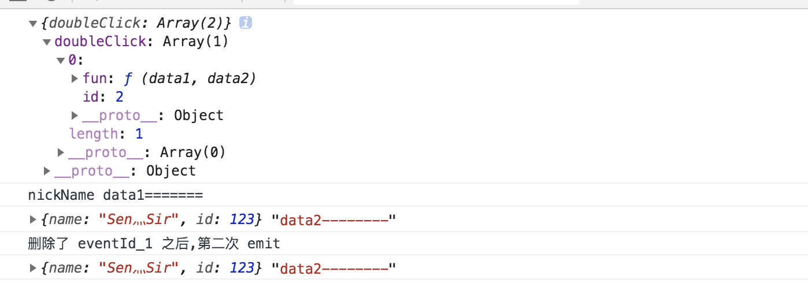

#### 实现 event
> 使用 on 监听事件返回事件id，使用emit触发函数, 使用del删除监听事件，允许多个函数监听

- 代码如下：
```javascript
class myEvent{
    constructor() {
        this.eventObj = {};
        this.id = 0;
    }
    emit() {
        const [ eventName, ...params ] = arguments;
        if (!this.eventObj[eventName].length) {
            console.log(`没有此事件～`);
        } else {
            var funArr = this.eventObj[eventName];
            funArr.forEach(funObj => {
                funObj.fun.apply(this, params);
            })
        }
    }
    on(eventName, callFun) {
        if (!this.eventObj[eventName]) {
            this.eventObj[eventName] = [];
        }
        ++this.id;
        this.eventObj[eventName].push({
            id: this.id,
            fun: callFun,
        });
        return this.id;
    }
    del(eventId) {
        const { eventObj } = this;
        for (let key in eventObj) {
            eventObj[key] = eventObj[key].filter(funObj => funObj.id !== eventId);
        }
    }
}
```
- 测试代码如下：
```javascript
const event = new myEvent();
const eventId_1 = event.on('doubleClick', function(data1, data2) {
    console.log(data1, 'data1=======');
})
const eventId_2 = event.on('doubleClick', function(data1, data2) {
    console.log(data2, 'data2--------');
})
console.log(event.eventObj);
event.emit('doubleClick', 'nickName', {name: 'Sen灬Sir', id: 123});
event.del(eventId_1);
console.log('删除了 eventId_1 之后,第二次 emit');
event.emit('doubleClick', 'nickName', {name: 'Sen灬Sir', id: 123});
```
- 输出如下：
